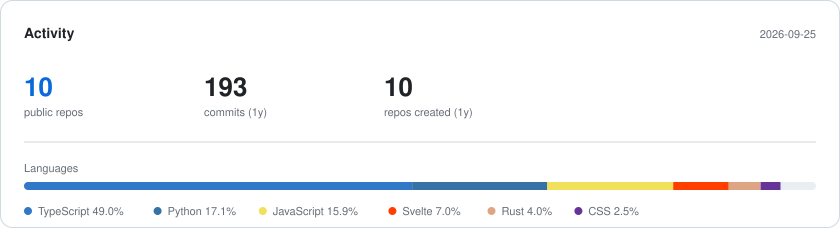

# Jeongin Kim 김정인

**M.S. Student**, [Software Testing Lab](https://selab.knu.ac.kr) · [Kyungpook National University](https://en.knu.ac.kr/) 
Advised by Prof. Woojin Lee · Daegu, Korea

LLM-driven generation of test environments for embedded software, and predictive
modeling on industrial process data.

---

## Research

**Software testing** · **LLM-based test generation** · **SIL verification environments** · **Predictive modeling on process data**

Mutation testing, test automation, and program analysis — with a working interest in
how far language models can be pushed to produce test artifacts that hold up under
coverage measurement rather than just looking plausible.

## Publications

Domestic conference papers, all in Korean. <b>Bold</b> = me, &ast; = corresponding author.

**3.** **Jeongin Kim**, Deokyeop Kim, Hyeryung Suh, Woojin Lee\* 
&nbsp;&nbsp;&nbsp;&nbsp;*Automatic Generation of Test Environment Behaviors Using LLM for Embedded Software Testing* 
&nbsp;&nbsp;&nbsp;&nbsp;Proc. **Korea Computer Congress (KCC)**, pp. 582–584, June 2026 · [code](https://github.com/99JIK/KCC2026)

**2.** **Jeongin Kim**, Woojin Lee\* 
&nbsp;&nbsp;&nbsp;&nbsp;*A Study on the Utilization of Sampling Time-point Data for Performance Enhancement of the Biodegradable Fiber Spinning Process* 
&nbsp;&nbsp;&nbsp;&nbsp;**UCWIT**, KIISE Yeongnam Branch, November 2025

**1.** **Jeongin Kim**, Woojin Lee\* 
&nbsp;&nbsp;&nbsp;&nbsp;*The Ability of Generative AI to Understand and Utilize Test Cases* 
&nbsp;&nbsp;&nbsp;&nbsp;Proc. **Korea Computer Congress (KCC)**, pp. 397–399, July 2025

### Patent

**Jeongin Kim**, Deokyeop Kim, Woojin Lee — *A Method for Selecting Robust Optimal Process Parameter Combinations* 
Provisional filed; full application in progress (July 2026). Applicant: KNU Industry-Academic Cooperation Foundation. MOTIE/KIAT P0022335.

## Selected Work

| | |
|---|---|
| **[KCC2026](https://github.com/99JIK/KCC2026)** | Three-stage decomposition–induction–synthesis prompt pipeline for SIL test environments. More than doubled coverage over zero-shot and few-shot baselines across 11 objects in three domains, consistent on GPT-4 and Llama-3 70B. |
| **[ST_YOUNGWON](https://github.com/99JIK/ST_YOUNGWON)** | RAG question answering over internal regulatory documents. Hierarchical chunking, hybrid keyword + vector retrieval, swappable LLM providers behind a protocol abstraction. FastAPI · ChromaDB · Docker. *In production use.* |
| **[ABB](https://github.com/99JIK/ABB)** | Real-time emotion classification from facial action units — up to 30 faces at once, IoU-based multi-face tracking, FastAPI REST and WebSocket streaming. MediaPipe · TensorFlow. |
| **[FOCUS](https://github.com/99JIK/FOCUS)** | Measures a learner's concentration from webcam video. Scores distraction from eye closure, head orientation, gaze with head-rotation compensation, yawning, and action units. |
| **[Provenance](https://github.com/99JIK/Provenance)** | Code plagiarism detection that compares structure rather than text — renaming variables, moving braces, or stripping comments does not hide a copy. Cross-platform desktop app with parsers bundled in, so no LLVM, JDK, or Python on the grader's machine. Rust. |

## Experience

**Graduate Researcher** · Software Testing Lab, KNU · 2024.12 – present 
**Researcher** (reverse engineering) · Arkdata · 2022.09 – 2024.06 
&nbsp;&nbsp;Reverse-engineered transaction log formats across Oracle, PostgreSQL, MariaDB/MySQL, and Tibero for a CDC solution; built a Kafka-based real-time pipeline.

**Teaching Assistant** · School of CSE, KNU · 2025.03 – present 
&nbsp;&nbsp;Introduction to Programming (4 terms) · System Programming and Creative Convergence Design · Java Programming

## Latest from [TIL](https://til.99jik.com)

<!-- BLOG-POST-LIST:START -->
- [260812](https://til.99jik.com/blog/260812)
- [260623](https://til.99jik.com/blog/260623)
- [260630](https://til.99jik.com/blog/260630)
- [260731](https://til.99jik.com/blog/260731)
- [CARLA Environment Evaluation](https://til.99jik.com/blog/260721)
<!-- BLOG-POST-LIST:END -->

## Stack

&nbsp;

&nbsp;

&nbsp;

## Activity

<picture>
  <source media="(prefers-color-scheme: dark)" srcset="assets/stats-dark.svg">
  
</picture>

<picture>
  <source media="(prefers-color-scheme: dark)" srcset="https://raw.githubusercontent.com/99JIK/99JIK/output/snake-dark.svg">
  
</picture>
